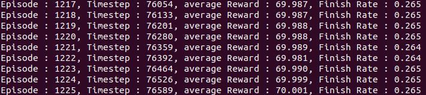
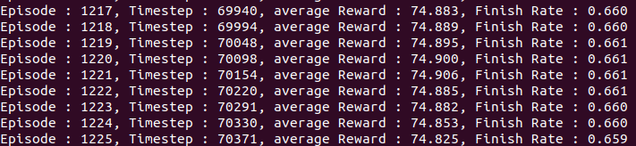
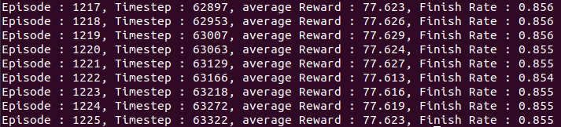
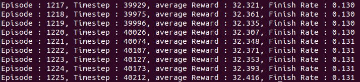
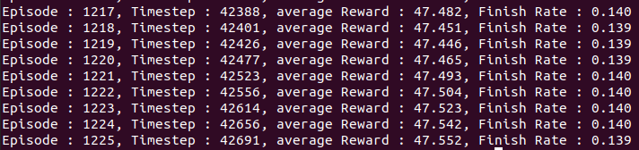
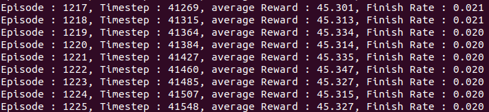
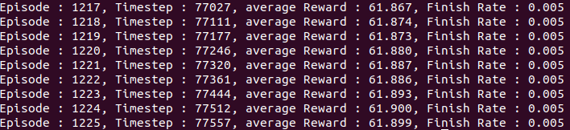

## DQN 실습

**DQN batch size=256** [tensorboard](https://tensorboard.dev/experiment/koRE2q49RgqOP4SdIaSBSQ)

**DQN batch size=512** [tensorboard](https://tensorboard.dev/experiment/nJW4ouZuRoqnz4LubJvrXA)

**DQN batch size=512, epsilon=0.05** [tensorboard](https://tensorboard.dev/experiment/NLMESaFgQr6InTPpeZsGQg)

**DQN batch size=512, epsilon=0.05, sync frequency=10000**[tensorboard](https://tensorboard.dev/experiment/Mf5mtJxMQKuwpYJ14pGrSA/)

**Double DQN batch size=256** [tensorboard](https://tensorboard.dev/experiment/gFB9tnNKQ261jYRlGqFkyA)

**Double DQN batch size=512** [tensorboard](https://tensorboard.dev/experiment/6HZ4Z7k0SBCl1QOA9X1IbQ)

**Dueling DQN batch size=256** [tensorboard](https://tensorboard.dev/experiment/yfqaXpMrQMCbnIl6xUP12Q)

[진행 상황 기록](daily_review.md)

### **How to train**
    python main.py                       # 기본 설정으로 실행
    python main.py -rn 4 -bs 64          # 배치사이즈 64로 39999*4 번 학습을 진행시키는 경우
    python main.py --double --dueling    # DoubleDQN과 DuelingDQN 적용하는 경우

---

## 모두의 연구소 Environment

### **How to use**
    train 코드를 작성하실 때 Sim.py 내에 있는 Simulator class를 이용하시면 됩니다.
    gym, grid world 등 강화학습 예시를 참고하시면서 진행 바랍니다.

### **Make virtual environment using conda**
    
    conda create -n venv
    conda activate venv

### **Prerequisite**
    
    pip install -r requirements.txt
    sudo apt install xvfb
    sudo apt install ffmpeg

### **Files**
train/test 데이터는 최종 목적지에 들어오기 전 가져와야 할 아이템들의 리스트로 이루어져습니다.

- Sim.py : 강화학습 환경
- draw_utils.py : visualization 코드
- factory_order_train.csv : train 데이터
- factory_order_test.csv  : test 데이터
- obstacles.csv : 장애물 위치 좌표
- box.csv : 아이템 위치 좌표

### **Troubleshooting**
    
    * 아래와 같은 pyglet 에러 나오면 주피터 노트북으로 실행하시고,
    pyglet.canvas.xlib.NoSuchDisplayException: Cannot connect to "None"
    -> xvfb-run -a jupyter notebook

    그후 주피터 노트북에서 train 파일을 실행하시면 됩니다.
    run train.py
